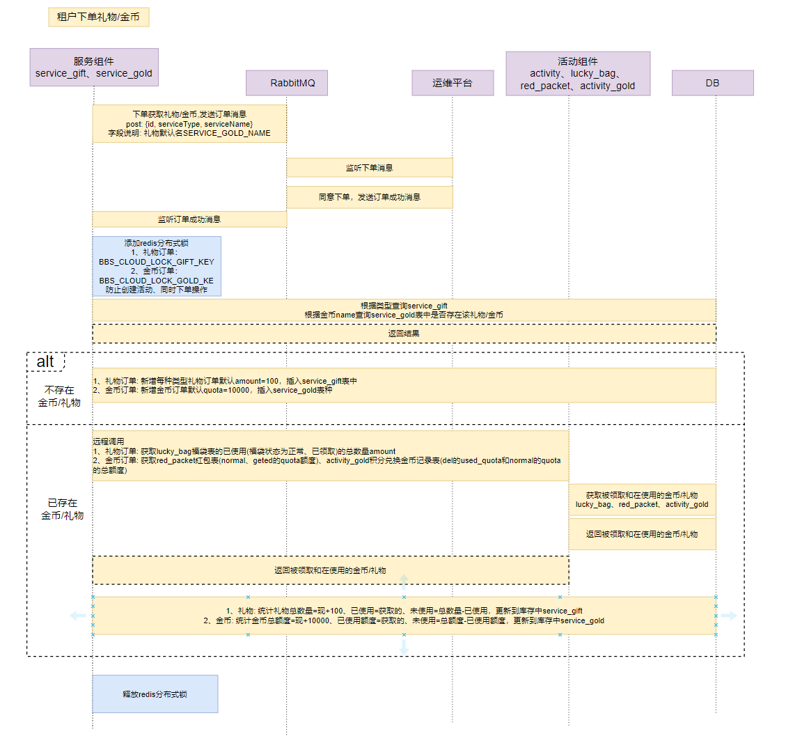
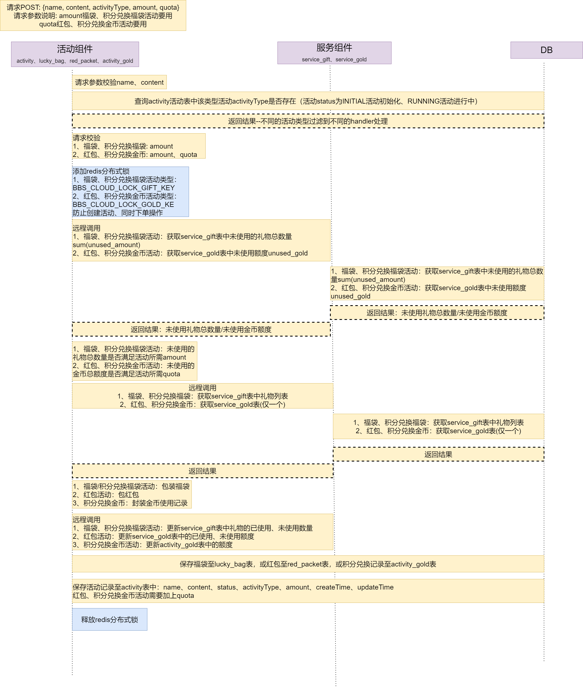
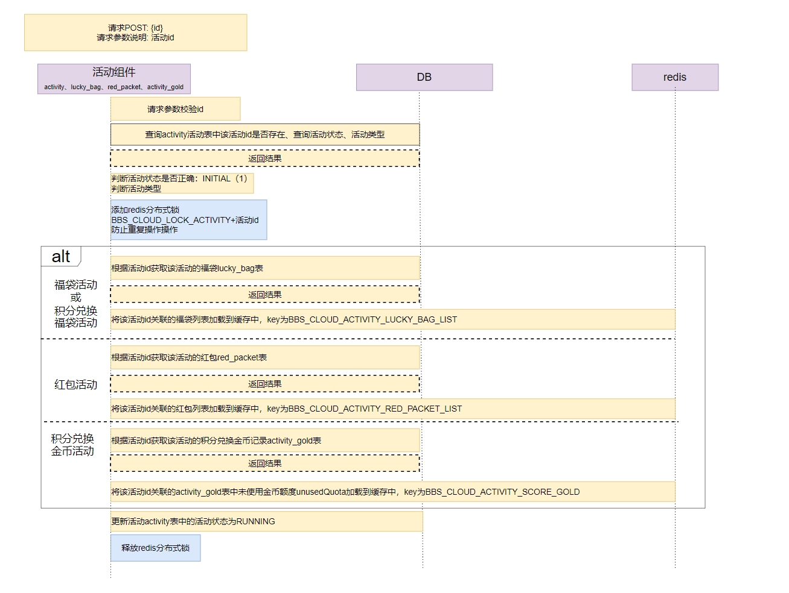
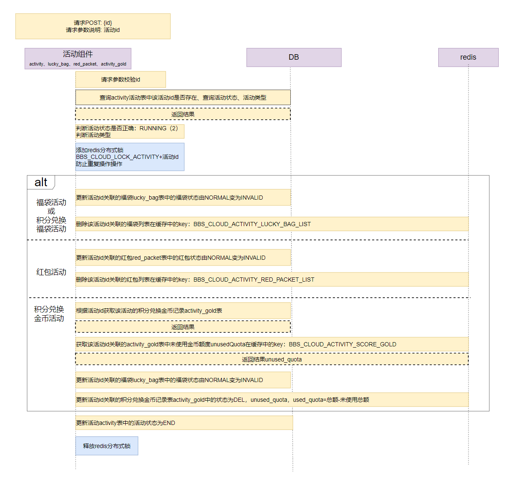

## 项目说明--论坛权益智能服务平台  
**技术栈**: Springboot、SpringCloud、Mybatis、MySQL、Redis、分布式  
**项目描述**: 该项目旨在打造一个供广大用户进行参与各种社交和交流的社交平台，项目分成公司端，租户端，用户端三个使用端，
公司通过社交产品免费提供给租户使用，租户通过向公司购买资源（例如礼物、金币）进行发布活动吸引用户活动和流量，用户可以通过发帖、评论、文章或者评论被点赞
获取积分，积分可以用于参与平台活动、打赏。  
**项目详细介绍**:   
运维服务: 公司通过运维系统管理礼物/金币/会员/广告等资源，同时审核租户的金币订单  
租户服务: 租户可以在运维平台进行金币下单服务，下单之后,可以利用礼物和金币进行包装福袋或者红包来发布具体的福袋、红包、积分兑换等一系列活动，来增加用户的活跃度。  
用户服务: 用户注册登录后可以发布文章，或在别人发布的文章下进行评论、点赞、打赏操作来获取积分，获取到的积分可以在参加租户发布的活动时进行福袋或者金币的兑换。
责任描述：作为核心研发人员，包含参与了解用户需求、产品需求、总体设计，负责租户端的服务模块以及活动模块开发工作  
**个人贡献**:  
参与系统部分设计以及功能模块的详细设计，根据需求进行编程，完成对系统的开发。  
采用 Spring Boot 实现微服务架构，根据职责边界进行拆分设计。   
租户活动组件:各种活动的发布、管理、查询活动列表、等接口的开发以及活动消息的处理  
租户下单组件:租户下单礼物/金币的接口实现，管理发布活动时所需金币  
基于 redis 实现分布式锁，实现共享资源的互斥访问。  
基于 RabbitMq 实现下订单异步存储库存，将订单消息发送到RabbitMQ，实现消息的异步解耦，提升系统效率和服务的稳定性。

## 租户端的下单、权益活动全生命周期时序图  
 - 租户下单时序图  
  
 - 租户创建活动时序图  
  
 - 租户启动活动时序图  
  
 - 租户终止活动时序图  
